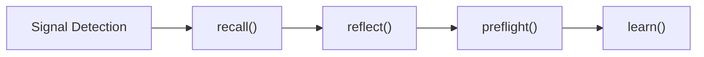

# .kit Technical Architecture Specification (AMSB v1.1 Stable)

`.kit` is a deterministic cognitive memory layer for multi-agent and human workflows. This document defines the storage model, ranking model, governance boundaries, runtime contracts, resilience model, and locked release scope for AMSB v1.1 stable.

## 0. Release Status And Scope Lock

**Release Status:** Production-ready  
**Release Line:** AMSB v1.1 Stable  
**Change Policy:** No new features in this line. Only bug fixes, maintenance, resilience hardening, and documentation clarifications are allowed.

This release includes:

- Core SQLite memory kernel with append-only ledger semantics
- Deterministic semantic ranking v1.1 with confidence assessment
- Multi-agent orchestration with repair loop, fallback routing, and preflight governance
- Resilience controls including circuit breaking, provider cooldowns, and persisted metrics
- Behavioral, storm, chaos, unit, and integration verification

This release explicitly excludes:

- Vector search, embeddings, or probabilistic RAG retrieval
- Semantic reasoning beyond explicit tags, scopes, and deterministic scoring
- Automatic resolution of conflicting invariants
- Feature expansion outside the locked architecture described in this document

## 0.1 Development Journey

`.kit` reached the current stable release through four architecture stages:

1. **Stage 1 - Core Memory And Deterministic Ledger**: SQLite kernel, immutable observations ledger, DAG lineage, compute-at-write scoring, and Unix-first CLI composition.
2. **Stage 2 - Multi-Agent And Agent Integration**: multi-provider execution, WAL-backed concurrent access, fallback safety, and stable memory injection contracts.
3. **Stage 3 - Semantic Layer And Meta-Cognition**: deterministic ranking, confidence margin, ambiguity detection, preflight blocking, and learn/reflect stabilization.
4. **Stage 4 - Resilience And Production Hardening**: circuit breakers, provider cooldown filtering, adaptive trust metrics, storm recovery, and behavioral integrity validation.

## 1. System Philosophy And Invariants

`.kit` guarantees the following architectural invariants:

- **Local Determinism:** rejects probabilistic retrieval. Identical inputs must yield identical ranked context.
- **Compute-at-Write:** read latency remains bounded by precomputed scoring and indexing.
- **Immutable Fact Ledger:** history is append-only, with supersession tracked explicitly through lineage.
- **Unix Composability:** the CLI remains stream-friendly and scriptable.

## 2. Physical Storage Model (SQLite Kernel)

Memory is governed by an embedded SQLite engine configured for ACID compliance in multi-agent environments.

### 2.1 Kernel Pragmata

```sql
PRAGMA journal_mode = WAL;
PRAGMA synchronous = NORMAL;
PRAGMA foreign_keys = ON;
PRAGMA busy_timeout = 5000;
```

### 2.2 Observation Ledger Schema

The central fact ledger is the `observations` table.

```sql
CREATE TABLE observations (
    id INTEGER PRIMARY KEY AUTOINCREMENT,
    node_id INTEGER NOT NULL,
    content TEXT NOT NULL,
    layer TEXT CHECK(layer IN ('working', 'episodic', 'semantic', 'procedural')) DEFAULT 'episodic',
    tag TEXT CHECK(tag IN ('invariant', 'decision', 'preference', 'note')) DEFAULT 'decision',
    importance REAL DEFAULT 1.0,
    materialized_score REAL NOT NULL DEFAULT 1.0,
    access_count INTEGER DEFAULT 0,
    created_at DATETIME DEFAULT CURRENT_TIMESTAMP,
    superseded_at DATETIME,
    last_accessed_at DATETIME DEFAULT CURRENT_TIMESTAMP,
    namespace TEXT DEFAULT 'shared',
    scope TEXT NOT NULL DEFAULT '',
    branch TEXT DEFAULT 'main',
    symbol TEXT,
    structural_hash TEXT,
    metadata TEXT DEFAULT '{}',
    commit_id TEXT,
    is_active BOOLEAN DEFAULT 1,
    supersedes_id INTEGER DEFAULT NULL,
    FOREIGN KEY (node_id) REFERENCES nodes(id) ON DELETE CASCADE,
    FOREIGN KEY (commit_id) REFERENCES commits(id),
    FOREIGN KEY (supersedes_id) REFERENCES observations(id) ON DELETE SET NULL
);
```

Key indices and helpers:

- `idx_obs_active_score` for active ranked retrieval
- `idx_obs_scope_created` for scope-aware queries
- `idx_obs_symbol` for symbol anchoring
- FTS support for deterministic keyword search

## 3. Cognitive Semantics Layer

Raw observations are interpreted through explicit tags:

1. **`invariant`**: hard architectural law. Violations trigger blockers.
2. **`decision`**: intentional design choice.
3. **`preference`**: local style or convention.
4. **`note`**: weak, informational, or advisory context.

## 4. Arbitration Engine

When multiple memories overlap, the engine resolves them deterministically.

### 4.1 Authority Override

The hierarchy is strict:

`invariant > decision > preference > note`

A lower-authority observation cannot override a higher-authority observation, regardless of recency or reinforcement.

### 4.2 Additive Scoring Model

For equal-authority or non-conflicting facts, runtime ranking is based on:

```text
Score_final = MaterializedScore_base * Frequency * Recency + Bonus_type + Bonus_scope
```

Stable components:

- Base score derived from importance, access count, and age
- Tag bonus: `invariant` (+0.3), `decision` (+0.2), `preference` (+0.1), `note` (+0.0)
- Scope bonus: exact symbol (+0.3), exact scope (+0.2), ancestor scope (+0.15), global (+0.1)

### 4.3 Confidence Metric

Confidence is computed from the top two ranked candidates:

```text
Confidence = (Score_winner - Score_runner_up) / (Score_winner + epsilon)
```

This value drives the assessment layer used by prompt injection and orchestration.

## 5. Cognitive Execution Flow

The production path from code change to persistent memory is locked to this order:

1. **Signal Detection**
2. **`recall()`**
3. **`reflect()`**
4. **`preflight()`**
5. **`learn()`**



This ordering is mandatory. Lower-authority memories may inform the loop, but they cannot bypass invariant enforcement.

## 6. Interface And Integration Boundaries

### 6.1 CLI Boundary

The CLI is stream-first and scriptable.

```bash
git diff | kit learn --tag decision --content "Refactored payment gateway to use webhooks"
kit recall auth_service --here
kit doctor --check-agents
```

### 6.2 Stable Python API Boundary

The main API surface is exposed through `kit.api`:

- `init_kernel()`
- `learn()`
- `search()`
- `recall()`
- `recall_with_assessment()`
- `export_prompt()`
- `reflect()`
- `preflight_check()`

### 6.3 Concurrency Boundary

The `.kit` binary remains stateless. SQLite WAL mode handles safe concurrent readers and bounded write contention across multiple agents.

## 7. Explicit Non-Goals

To preserve deterministic behavior, `.kit` deliberately excludes:

- Semantic code understanding driven by LLM inference
- Vector retrieval or approximate nearest-neighbor search
- Implicit conflict resolution between incompatible invariants
- Scope expansion outside memory, governance, orchestration, resilience, and verification

## 8. Failure Modes And Deterministic Error Handling

- **Ambiguity:** if competing memories are too close in score, the assessment is `AMBIGUOUS`.
- **Invariant Violation:** if a proposed change conflicts with an invariant, the status is `BLOCK`.
- **Contextual Gap:** if a signal appears without supporting memory, it is treated as a gap.
- **Disconnected Memory:** observations without scope or symbol are treated as global and score lower.

## 9. Memory Injection Contract

Prompt construction is bounded and deterministic.

Stable contract:

- Top-K memories: `3`
- Empty memory export returns an empty string
- Export uses compact first-line rendering
- Prompt budget defaults to approximately `200`
- Prompt injection must not flood local models with oversized memory blocks

Assessment-aware injection states:

- `HIGH_CONFIDENCE`
- `AMBIGUOUS`
- `WEAK_SIGNAL`
- `EMPTY`

## 10. SQLite Concurrency And Resilience Model

Safe multi-agent writes rely on:

- WAL mode
- `BEGIN IMMEDIATE` for write transactions
- bounded retry logic
- unified write paths for learn, touch, promote, and commit

Guarantees:

- no silent data drops under concurrent writes
- bounded latency under lock contention
- deterministic failure when retry budget is exhausted

### 10.1 Production Resilience Extensions

The stable runtime extends kernel guarantees with provider-facing resilience controls:

- circuit breaker for `503` and capacity exhaustion
- cooldown-aware router filtering
- severity-aware trust reduction
- persisted agent metrics in SQLite
- recovery tooling through `kit doctor --check-agents` and `kit doctor --reset-cloud`

## 11. Agent Orchestration Boundary (`kit-agent`)

`.kit` is the deterministic memory kernel. `kit-agent` is the execution and orchestration layer.

### `.kit` responsibilities

- persistent memory storage
- deterministic recall and arbitration
- governance gates through `reflect` and `preflight`
- model-agnostic operation

### `kit-agent` responsibilities

- adaptive routing
- local fallback
- repair loop control
- confidence-aware prompt injection
- persisted health and routing metrics

## 12. Semantic Ranking And Assessment (Locked In v1.1)

The semantic layer is no longer experimental in the stable release. Its externally visible behavior is locked by unit, integration, behavioral, and storm tests.

Stable guarantees:

- deterministic ranking across `recall`, `search`, and `reflect`
- additive scoring that preserves append-only semantics
- conflict arbitration under tag authority and scope matching
- confidence margin and ambiguity detection
- backward-compatible assessment without breaking recall APIs

Assessment model:

- `HIGH_CONFIDENCE`: inject as authoritative memory context
- `AMBIGUOUS`: inject with caution framing
- `WEAK_SIGNAL`: inject lightly and avoid overclaiming
- `EMPTY`: omit the memory block entirely

## 13. Verification Matrix

The AMSB v1.1 stable line is locked by the following verification categories:

- unit tests for kernel, ranking, schema evolution, and deterministic behavior
- integration tests for CLI, protocol, fallback, and provider routing
- chaos and stress tests for degraded conditions
- storm tests for repeated `503` and cooldown enforcement
- behavioral integrity evaluation for adherence, nuance, and hallucination control

These tests define the release contract. Architectural behavior described here must remain consistent unless a future version explicitly supersedes this document.

## 14. Official Non-Goals (Release Boundary)

The following remain out of scope for AMSB v1.1 stable:

- expanding semantic understanding beyond explicit metadata
- introducing embeddings, ANN indexes, or vector retrieval
- auto-merging or auto-resolving conflicting invariants
- adding new product surface area beyond the locked release scope

---

*Last Updated: 2026-03-18 | Cognitive-Version: AMSB v1.1 Stable*
