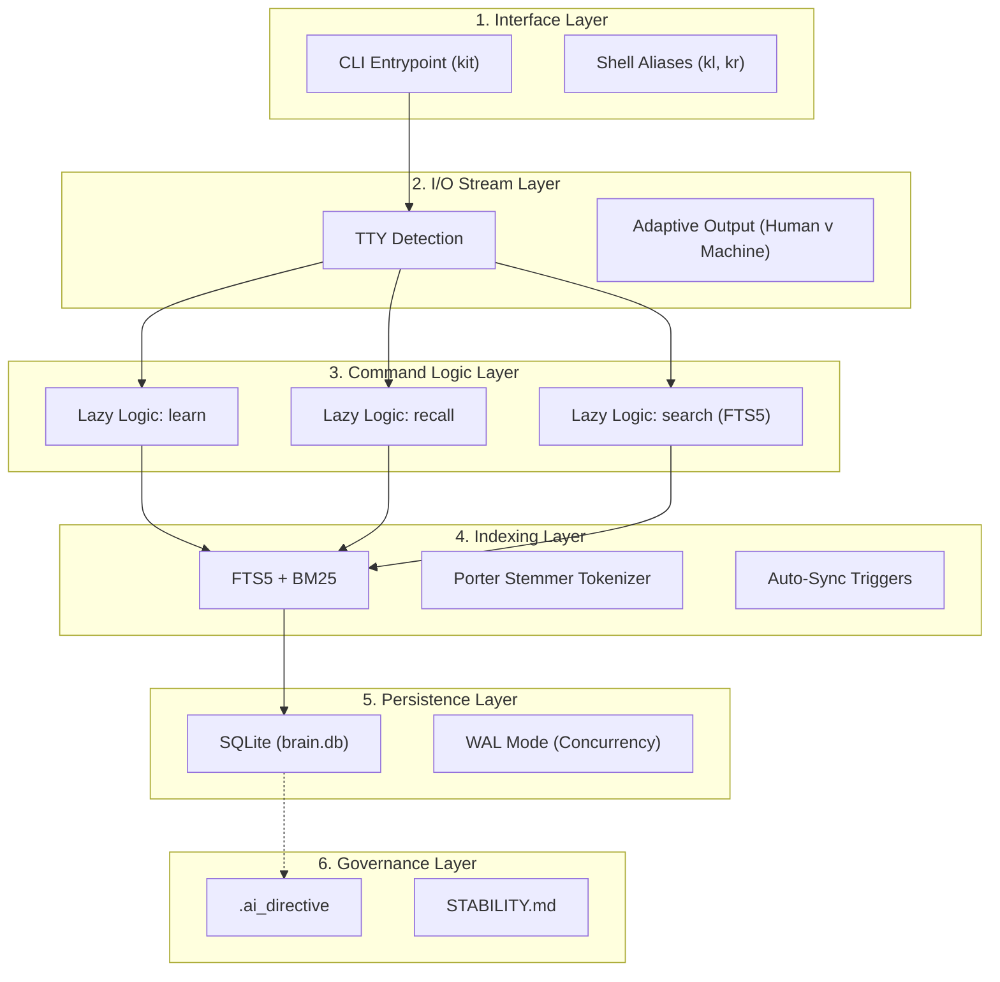

# 🏛️ .kit Architecture (v2.0 SAM Epoch)

## 1. Philosophy (Triết lý)
`.kit` là một **Agent Memory Engine**, không phải một framework. Thiết kế dựa trên 3 nguyên tắc bất di bất dịch:
- **Engine-first**: Nhỏ gọn, Zero-Dependency.
- **Immutable memory ledger**: Sự thật là bất biến và có thể truy vết.
- **LLM-agnostic storage**: Không phụ thuộc vào mô hình AI hay Vector Embeddings.

Mục tiêu của `.kit` là trở thành **SQLite cho Agent Memory** — một hạ tầng lưu trữ trí nhớ tất định cho AI Agents.

## 2. Elite Architecture (The 6-Layer Map)

Để đạt được đẳng cấp "Infra-grade", `.kit` được thiết kế theo cấu trúc 6 tầng hội tụ:



---

## 3. Immutable Fact Ledger
`.kit` sử dụng cơ chế **Append-only**. Facts không bao giờ bị xoá hay sửa đổi trực tiếp.
```sql
facts (
    id INTEGER PRIMARY KEY,
    entity_id INTEGER,
    content TEXT NOT NULL,
    importance REAL DEFAULT 0.5,
    access_count INTEGER DEFAULT 0,
    supersedes_id INTEGER, -- Lineage link
    is_active BOOLEAN DEFAULT 1,
    metadata TEXT DEFAULT '{}', -- JSON Escape Hatch
    created_at DATETIME DEFAULT CURRENT_TIMESTAMP
)
```
Khi kiến thức thay đổi:
1. **INSERT** fact mới với `replaces_id`.
2. **SET** `old_fact.is_active = 0` (Logical deletion).
Điều này hỗ trợ: **Audit trail**, **Rollback**, và **Time-travel debugging**.

---

## 4. SQLite Search Engine (The FTS5 Core)
Thay vì sử dụng Vector Search nặng nề, `.kit` sử dụng **FTS5 External Content** làm nền tảng tìm kiếm từ khóa.

- **Porter Tokenizer**: Tự động đưa từ về dạng gốc (ví dụ: `connecting` -> `connect`), giúp tìm kiếm chính xác và linh hoạt.
- **Zero Duplication**: FTS index chỉ lưu trữ pointer tới nội dung gốc, tiết kiệm dung lượng DB.
- **Sub-50ms Latency**: Đảm bảo tốc độ "tức thì" ngay cả với tập dữ liệu lớn.

---

## 4. Cognitive Ranking Algorithm (Half-life Decay)
`.kit` sử dụng thuật toán phân rã tự nhiên để bảo tồn tri thức dài hạn mà không bị "xóa sổ" bởi thời gian.

$$Score = Importance \times \log_{10}(AccessCount + 2) \times \frac{1}{1 + (DaysOld / 30)}$$

| Yếu tố | Vai trò | Chức năng |
| --- | --- | --- |
| **Importance** | Semantic Weight | Trọng số bản thể (0.1 - 1.0). |
| **Frequency** | Reinforcement | Càng dùng nhiều điểm càng cao (Log-scale). |
| **Recency** | Half-life Decay | Phân rã theo chu kỳ bán rã (Mặc định: 30 ngày). |

---

## 6. Temporal Graph Memory (Chronos Layer)
`.kit` không chỉ lưu trữ tri thức hiện tại mà còn bảo tồn toàn bộ lịch sử tiến hóa của tri thức.

- **Snapshot Query**: Cho phép truy xuất trạng thái tri thức tại bất kỳ thời điểm nào trong quá khứ thông qua tham số `--at`.
- **Relationship Lineage**: Các liên kết (`relations`) mang dấu mốc `created_at` và `superseded_at`, cho phép lật lại các quyết định kiến trúc cũ.

*Ví dụ*: `kit recall --entities auth --at "2024-01-01"` sẽ trả về các Fact và quan hệ có hiệu lực tại ngày đó.

---

## 7. Unified Knowledge Quad (Quad-Store)
Hệ thống vận hành trên 4 trụ cột logic ("4 Bảng Chân lý"):
1. **Nodes (`entities`)**: Định danh & Phân loại thực thể.
2. **Observations (`facts`)**: Tri thức nguyên tử & Episodic Records.
3. **Edges (`relations`)**: Cấu trúc liên kết temporal.
4. **Keyword Index (`facts_fts`)**: Search engine tốc độ cao.

---

## 6. Public API (`kit/api.py`)
Tất cả các tích hợp bắt buộc phải thông qua lớp API này:
- `init_kernel(db_path)`: Khởi tạo engine.
- `learn(uid, kind, content, replaces_id=None)`: Nạp trí nhớ.
- `recall(entities, limit)`: Truy xuất ngữ cảnh đã ranked.
- `export_prompt(entities, limit, budget)`: Kết xuất prompt (XML/Markdown).

---

## 7. Minimal Example
```python
from pathlib import Path
from kit.api import init_kernel, learn, recall

# 1. Khởi tạo Engine (Zero-dependency SQLite)
init_kernel(Path("memory.db"))

# 2. Ghi nhớ (Immutable Fact Ledger)
learn("auth_system", "component", "JWT uses HS256 algorithm")

# 3. Truy xuất (Ranked & 1-Hop Expanded)
memories = recall(["auth_system"], limit=5)

for m in memories:
    print(f"[{m.entity_uid}] -> {m.content}")
```

---

## 8. CLI Interface
CLI của `.kit` chỉ là một lớp vỏ (thin wrapper) gọi trực tiếp vào API:
- `kit learn`
- `kit recall`
- `kit export`

## 9. Design Guarantees
- **Deterministic Ranking**: Cùng dữ liệu, cùng kết quả.
- **Append-only Memory**: Không bao giờ mất lịch sử.
- **LLM-Agnostic**: Trí nhớ thuần túy, không phụ thuộc Model.
- **Zero-Infrastructure**: Chỉ cần SQLite và Python 3.14+.

---

## 11. Long-Term Stability
Sau v2.0 (SAM Epoch), dự án cam kết:
- **Facts Schema**: Đóng băng (Frozen).
- **API Signatures**: Ổn định (Stable).
- **Engine**: Chỉ thêm tính năng, không phá vỡ cấu trúc cũ.
