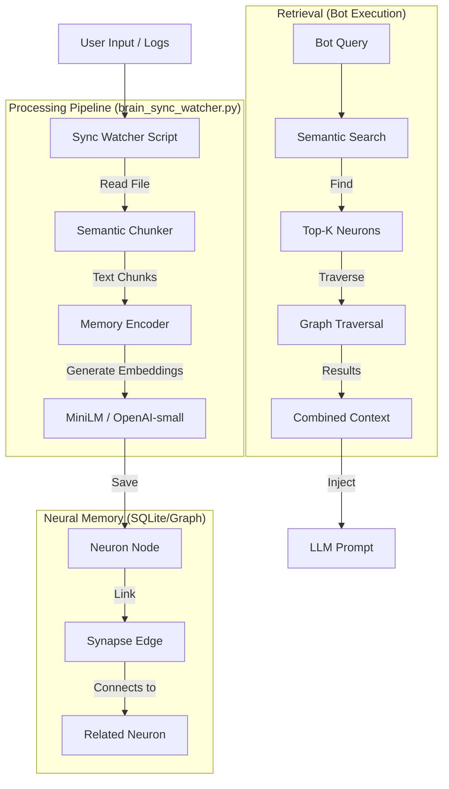

# Neural Memory Architecture for OpenBot

This document explains the **Neural Memory** logic used in Antigravity. You can replicate this architecture for your **OpenBot** to drastically reduce token usage while maintaining long-term memory.

## 1. The Core Problem & Solution

**Problem:** Sending the entire conversation history (Context Window) to the LLM is expensive (Tokens $$) and confuses the model with irrelevant details.
**Solution:** **Tiered Memory (RAG + Graph)**.
- **Tier 1 (Hot):** Latest conversation (RAM/Context).
- **Tier 2 (Warm):** Neural Memory (Graph/Vector DB) - Stores *concepts* and *connections*.
- **Tier 3 (Cold):** Raw Files (Archive).

**Token Saving Mechanism:** instead of finding *files*, we find *relevant snippets* (Neurons).
> **Input:** "How do I fix the API bug?"
> **Old Way:** Send `all_logs.md` (10k tokens).
> **New Way:** Search Graph -> Find "API" + "Bug" -> Retrieve 3 chunks (500 tokens) -> Send to LLM.

---

## 2. Architecture Diagram



---

## 3. Key Components (How to Code It)

### A. Semantic Chunking (The Input Filter)
Don't save everything. Slice logs into meaningful "thoughts".
*Current Antigravity Logic:*
- **Split**: By Markdown Headers (`#`) or Double Newlines (`\n\n`).
- **Overlap**: Keep previous 1-2 lines to preserve context.
- **Filter**: Drop chunks < 50 characters (noise).

```python
def chunk_content(text):
    # Split by headers to keep logical sections together
    chunks = []
    current_chunk = []
    for line in text.split('\n'):
        if line.startswith('#'):
            # Save previous chunk
            chunks.append("\n".join(current_chunk))
            # Start new with Header
            current_chunk = [line] 
        else:
            current_chunk.append(line)
    return chunks
```

### B. The Memory Encoder (The Brain)
Converts text into "Neurons".
- **Vector**: Mathematical representation of meaning (using `sentence-transformers` or `text-embedding-3-small`).
- **Keywords**: Extract distinct nouns/verbs for specific filtering (e.g., "Python", "API", "Error 500").

### C. The Associative Graph (The Secret Sauce)
This is what makes it "Neural" and not just a database.
- When saving `Chunk A` ("Fixing API login"), if it shares keywords with `Chunk B` ("Login timeout error"), a **Synapse** is created between them.
- **Benefit**: When you ask about "Login", the bot remembers "API" AND "Timeout" automatically.

### D. Retrieval (Reflex Pipeline)
When OpenBot needs memory:
1.  **Vector Search**: Find the most similar neurons to the user's query.
2.  **Graph Walk**: Look at connected neurons (Synapses). If `Neuron A` is highly relevant, check its neighbors.
3.  **Re-ranking**: Sort results by relevance score.
4.  **Context Construction**: Stitch the text of the top 3-5 results into the prompt.

---

## 4. Implementation Steps for OpenBot

1.  **Install Library**: Use the same library or `chromadb` + `networkx`.
    ```bash
    pip install neural-memory
    ```
2.  **Create a Watcher**:
    - Monitor your bot's conversation logs.
    - On new log -> `Chunk` -> `Encode` -> `Save`.
3.  **Modify Bot Prompting**:
    ```python
    # Before calling LLM
    query = user_input
    context = await brain.query(query) # Only gets ~500 tokens of relevant info
    
    prompt = f"""
    Context: {context}
    User: {query}
    """
    ```

## 5. Why this saves tokens?
- **Retention**: You store *infinite* history on disk (SQLite).
- **Injection**: You only inject *tiny* relevant slivers into the LLM context windown.
- **Result**: You can have a 1GB memory file, but each query only costs ~1k tokens even after years of chatting.
