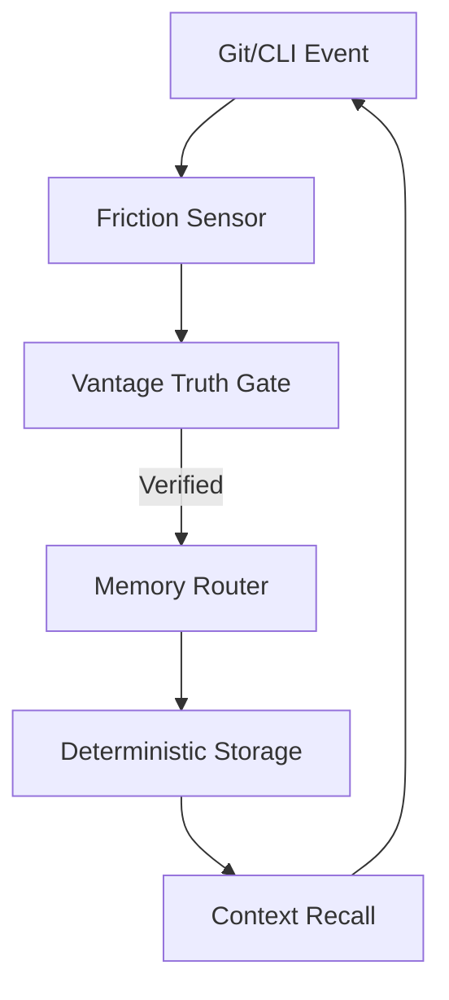

# 📦 memory-share-kit

> A lightweight cognitive runtime CLI for persistent memory + tool-driven reasoning.

---

## 🐍 Requirements

- **Python 3.14.x Required**
- This runtime is tested and supported strictly on Python 3.14.4+.

## 🖥 Supported Environment

- **OS**: Windows 10/11 (fully tested)
- **Runtime**: Python 3.14.4+
- **Database**: SQLite (bundled with Python 3.14, WAL + STRICT mode)

---

## ⚡ Install

```bash
pip install memory-share-kit
```

---

## 🚀 Quick Start

```bash
kit init
```

Initializes the local cognitive environment and seals the kernel.

---

## 🏗 Architecture Overview

The system operates as a **friction-triggered cognitive substrate**. It does not possess autonomous agency; instead, it records verified system events as a side-effect of environmental changes (Git commits, CLI actions).

### The Learning Loop



For a detailed breakdown of the internal pipeline, see [LEARNING_LOOP.md](./LEARNING_LOOP.md).

---

## 🧠 Memory Topology

Kit enforces a **4-tier deterministic memory model**:

- **L1 — Local Brain**: Repository-specific reasoning and context.
- **L2 — Global Brain**: Shared user-level knowledge across projects.
- **L3 — Frozen Law**: Immutable architectural invariants (Read-Only).
- **L4 — Audit Trace**: Forensic log of all cognitive routing decisions.

---

## 🧪 Minimal Workflow Example

The following sequence represents a standard deterministic session:

```bash
# 1. Initialize
kit init

# 2. Record a decision or invariant
kit learn --tag decision "Always use WAL mode for high concurrency"

# 3. Recall the context
kit recall

# 4. Verify structural integrity
kit-vantage verify
```

---

## 🧠 Usage Summary

### Store knowledge
```bash
kit learn --tag decision "Use WAL mode for deterministic writes"
```

### Recall context
```bash
kit recall
```

### Search memory
```bash
kit search "router failure"
```

### Verify integrity
```bash
kit-vantage verify
```

---

## 🔍 Verification Layer (Optional)

Kit supports external structural verification using **Vantage**. While optional, it is highly recommended for production-grade cognitive kernels to prevent drift and ensure topological integrity.

**Install Vantage:**
[https://github.com/so-sai/Vantage](https://github.com/so-sai/Vantage)

After installation, you can run forensic verification:
```bash
kit-vantage verify
```

---

## 🛡️ Core Principles

- **Runtime is Truth**: The executing environment is the only valid state.
- **CLI is Interface**: Clean, tool-first access to the cognitive kernel.
- **Memory is Persistent**: Deterministic storage with SQLite WAL + JSONB.
- **Verification is External**: Integrity is enforced by the **Vantage** sensor layer.

---

## 🛠️ Failure Recovery

If the system enters a friction state or memory drift is detected:

```bash
kit doctor          # Diagnose health
kit doctor --heal   # Automatically repair common artifacts
```

---

## 📌 Version

v1.2.5 (Titanium)
